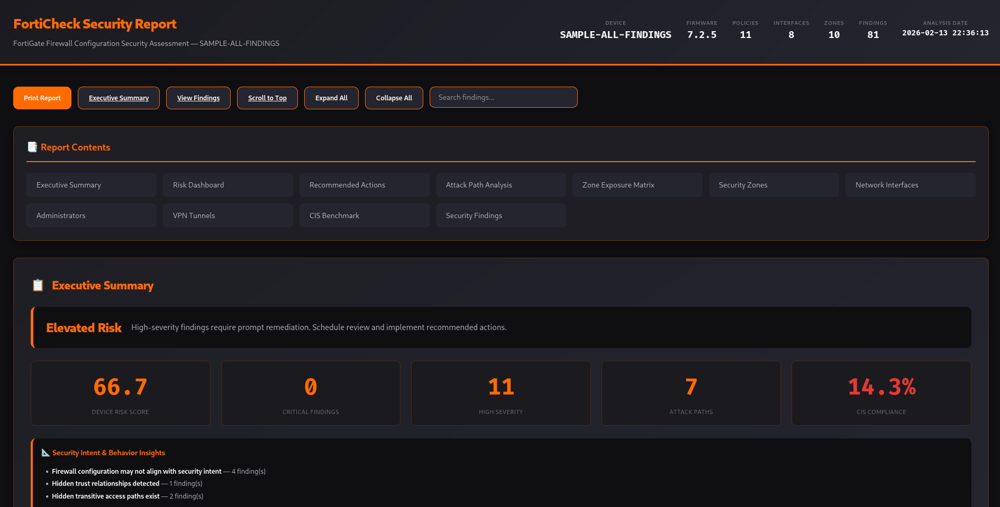
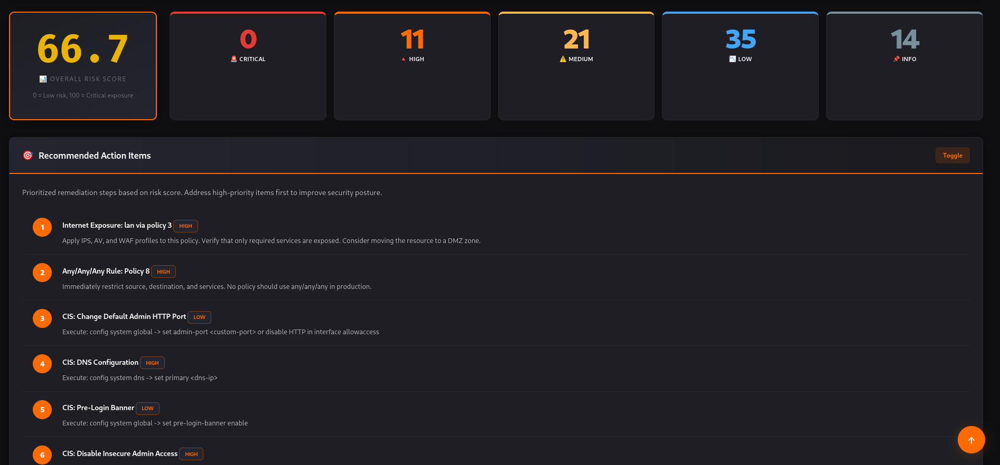
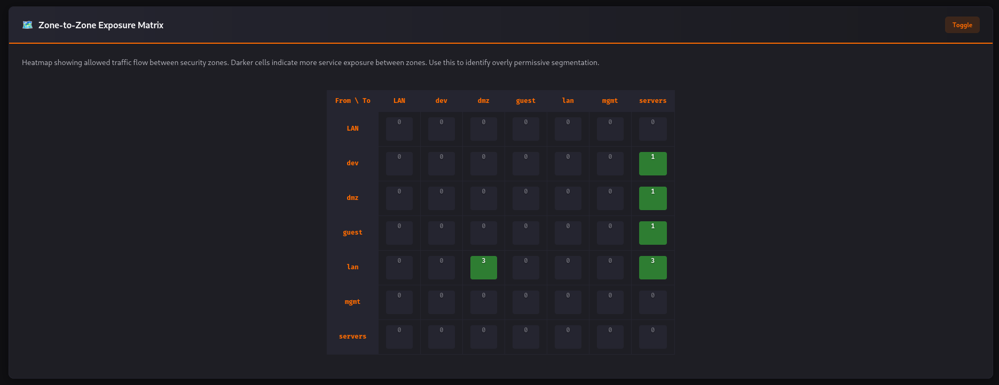
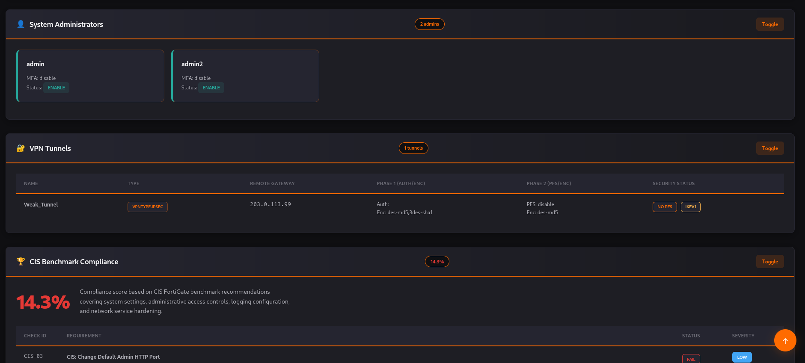
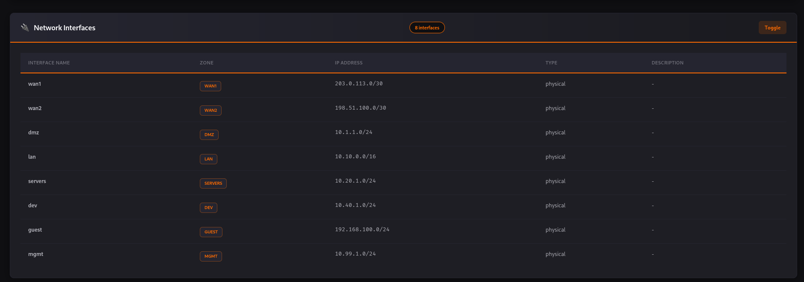

# FortiCheck

**FortiGate Firewalları için Kurumsal Güvenlik Analizi**

FortiCheck, FortiGate firewall konfigürasyonlarını çevrimdışı (offline) olarak analiz eden; güvenlik açıklarını, hatalı yapılandırmaları ve potansiyel saldırı yollarını tespit eden güçlü bir statik analiz aracıdır. Basit uyumluluk (compliance) araçlarının aksine FortiCheck, ağınızı bir **graf modeli** ile haritalandırarak politikalarınızın *niyetini* ve *etkisini* analiz eder.

---

## Temel Özellikler

*   **Derin Politika Analizi:** Gölge (shadowed) kuralları, gereksiz (redundant) kuralları ve sıralama hatalarını tespit eder.
*   **Saldırı Yolu Simülasyonu:** Çok adımlı saldırı vektörlerini simüle eder (örneğin: İnternet → DMZ → İç Ağ).
*   **Erişim Yüzeyi Analizi:** Güvensiz bölgelerden iç varlıklara açık olan erişimleri belirler.
*   **Kullanıcı ve VPN Denetimi:** MFA ihlallerini, zayıf VPN şifrelemelerini (DES/3DES/MD5) ve eski IKEv1 protokol kullanımlarını tespit eder.
*   **Güvenlik Profili Açıkları:** IPS, AV, Web Filtresi gibi kritik profillerin atanmadığı politikaları bulur.
*   **Bağlam Duyarlı Risk Puanlama:** Her bulguya erişim açıklığı, varlık hassasiyeti ve güven seviyelerine göre 0-100 arası bir risk skoru atar.
*   **Profesyonel Raporlama:** Yönetim ve teknik ekipler için uygun, bağımsız çalışan, interaktif bir HTML raporu oluşturur.

## Kurulum

Gereksinimler: Python 3.11+

**requirements.txt ile kurulum**

```bash
git clone https://github.com/cumakurt/forticheck.git
cd forticheck
pip install -r requirements.txt
pip install -e .
```

- `pip install -r requirements.txt` çalışma zamanı bağımlılıklarını yükler (click, pydantic, netaddr, networkx, jinja2, rich, pyyaml).
- `pip install -e .` FortiCheck’i düzenlenebilir modda kurar ve `forticheck` komutunu kullanıma açar. Normal kurulum için `pip install .` kullanın.

**Poetry ile kurulum**

```bash
git clone https://github.com/cumakurt/forticheck.git
cd forticheck
poetry install
```

**GitHub üzerinden kurulum**

```bash
pip install git+https://github.com/cumakurt/forticheck.git
```

Geliştirme (test, lint) için Poetry veya `pip install -e ".[dev]"` kullanın.

## Docker

FortiCheck, makinenize Python veya bağımlılık kurmadan Docker ile çalıştırılabilir. Sadece Docker kurulu olmalıdır.

### Görüntüyü derleme

Proje kök dizininde:

```bash
git clone https://github.com/cumakurt/forticheck.git
cd forticheck
docker build -t forticheck:latest .
```

### Raporların yazıldığı yer

Konteyner çalışma dizini olarak `/workspace` kullanır. Raporların ana makinede görünmesi için bir dizini konteynere bağlamanız (volume mount) gerekir. İki yaygın kullanım:

| Amaç | Mount | Config yolu | Çıktı seçeneği |
|------|--------|--------------|----------------|
| Raporlar bulunduğunuz dizinde | `-v $(pwd):/workspace` | `-c /workspace/dosya.conf` | `-o` yazmadan (varsayılan: `/workspace/<ad>_<tarih>_<saat>.html`) veya `-o /workspace/rapor.html` |
| Raporlar /tmp içinde | `-v /tmp:/tmp` | `-c /tmp/dosya.conf` | `-o /tmp/rapor.html` |

Volume bağlamazsanız rapor yalnızca konteyner içinde oluşur ve ana makineden erişilemez.

### Örnek: Rapor bulunduğunuz dizinde

Config dosyanızı mevcut dizine koyun, dizini `/workspace` olarak bağlayın. Varsayılan çıktı adı `{config_adı}_{YYYY-MM-DD_HHMMSS}.html` olur ve mevcut dizinde görünür.

```bash
# Tek config, çıktı varsayılan adda
docker run --rm -v "$(pwd):/workspace" forticheck:latest analyze -c /workspace/fortigate.conf
# Rapor: ./fortigate_2025-02-13_143022.html

# Çıktı dosya adını belirterek
docker run --rm -v "$(pwd):/workspace" forticheck:latest analyze -c /workspace/fortigate.conf -o /workspace/denetim_raporu.html
# Rapor: ./denetim_raporu.html
```

### Örnek: Rapor /tmp içinde

Config ve raporun ikisini de ana makinede `/tmp` altında görmek için `/tmp` bağlayın.

```bash
cp /path/to/fortigate.conf /tmp/
docker run --rm -v /tmp:/tmp forticheck:latest analyze -c /tmp/fortigate.conf -o /tmp/forticheck_rapor.html
# Ana makinede rapor: /tmp/forticheck_rapor.html
```

### Örnek: HTML + JSON, özel trust ve kurallar

Config, isteğe bağlı `trust_levels.yaml` ve `custom_rules.yaml` dosyalarının bulunduğu dizini bağlayın; çıktıyı aynı dizine yazdırın.

```bash
docker run --rm -v "$(pwd):/workspace" forticheck:latest analyze \
  -c /workspace/fortigate.conf \
  -o /workspace/denetim \
  -f both \
  --zones-trust /workspace/trust_levels.yaml \
  --rules /workspace/custom_rules.yaml
# Oluşan dosyalar: ./denetim.html ve ./denetim.json
```

### Örnek: Config diff (Docker)

İki config’i içeren dizini bağlayın; diff JSON çıktısını aynı dizine verin.

```bash
docker run --rm -v "$(pwd):/workspace" forticheck:latest diff \
  --before /workspace/eski.conf \
  --after /workspace/yeni.conf \
  -o /workspace/diff_sonuc.json
```

### docker run seçenekleri özeti

| Seçenek | Açıklama |
|--------|----------|
| `--rm` | Çalışma bitince konteyneri siler (önerilir). |
| `-v HOST_DIZIN:/workspace` | Ana makine dizinini bağlar; config ve raporlar host’ta kalır. `/tmp` için `-v /tmp:/tmp` kullanın. |
| `-c /workspace/dosya.conf` | Konteyner içindeki config yolu (bağladığınız yolla uyumlu olmalı). |
| `-o /workspace/rapor.html` | Konteyner içindeki çıktı yolu (dosyayı host’ta görmek için mount edilen bir yol olmalı). |

### Makefile varsa

Projede Makefile varsa:

```bash
make docker-build
make docker-run CONFIG=fw.conf
```

## Kullanım

FortiCheck tamamen çevrimdışı çalışır. Tek ihtiyaç FortiGate cihazından alınmış yedek konfigürasyon dosyası (`.conf`) veya `show run` çıktısıdır.

### Komutlar

| Komut | Açıklama |
|--------|----------|
| `forticheck analyze -c CONFIG [seçenekler]` | FortiGate config’ini analiz eder; HTML ve/veya JSON rapor üretir. |
| `forticheck diff --before ESKİ --after YENİ [-o ÇIKTI]` | İki config’i karşılaştırır; policy ekleme/silme/değişiklikleri JSON olarak yazar. |
| `forticheck --help` | Ana yardım. |
| `forticheck analyze --help` | Tüm analyze seçenekleri. |

### Temel analiz

```bash
forticheck analyze -c /path/to/fortigate.conf
```

Varsayılan olarak rapor, mevcut dizinde `{config_dosya_adı}_{tarih}_{saat}.html` adıyla kaydedilir (ör. `fortigate_2025-02-13_143022.html`).

### Analyze seçenekleri (özet)

| Seçenek | Kısa | Açıklama |
|--------|------|----------|
| `--config` | `-c` | FortiGate config dosyası yolu (zorunlu). |
| `--output` | `-o` | Rapor dosya yolu. Varsayılan: `{config_adı}_{YYYY-MM-DD_HHMMSS}.html`. |
| `--format` | `-f` | `html`, `json` veya `both`. Varsayılan: `html`. |
| `--zones-trust` | `-z` | Bölge güven seviyeleri (0–100) içeren YAML dosyası. |
| `--rules` | `-r` | Özel kurallar YAML’ı (forbid_service, require_security_profile). |
| `--min-severity` | | Sadece bu seviye ve üstü bulgular: `info`, `low`, `medium`, `high`, `critical`. |
| `--verbose` | `-v` | Ayrıntılı log. |

### Gelişmiş kullanım örnekleri

```bash
# Belirli bir yola HTML + JSON
forticheck analyze -c fw.conf -o ./raporlar/denetim_sonucu.html -f both

# Hata ayıklama için ayrıntılı log
forticheck analyze -c fw.conf -v

# Özel bölge güven seviyeleri (risk skoru için)
forticheck analyze -c fw.conf --zones-trust guven_seviyeleri.yaml

# Özel güvenlik kuralları
forticheck analyze -c fw.conf --rules custom_rules.yaml

# Sadece medium ve üzeri bulgular
forticheck analyze -c fw.conf --min-severity medium
```

### Özel Bölge Güvenlik Seviyeleri (`guven_seviyeleri.yaml`)

Bölgelerinizin güven seviyesini (0-100) tanımlayarak analiz doğruluğunu artırabilirsiniz:

```yaml
zones:
  internet: 0
  dmz: 30
  misafir: 10
  lan: 90
  sunucular: 100
```

## Rapor Örneği

Oluşturulan HTML rapor şunları içerir:
- **Yönetici Özeti:** Risk skoru, kritik bulgu sayısı ve uyumluluk özeti.
- **Saldırı Yolu Görselleştirme:** Saldırganın ağ içinde nasıl hareket ettiğinin görsel haritası.
- **Detaylı Bulgular:** Her sorun için aksiyon alınabilir düzeltme önerileri.
- **VPN & Kullanıcı Denetimi:** Uzaktan erişim güvenliği için özel bölümler.



| Yönetici Özeti & Risk Paneli | Bölge Erişim Matrisi | CIS Uyumluluk |
|------------------------------|----------------------|---------------|
|  |  |  |



## Mimari

FortiCheck analiz sürecini 8 katmanda gerçekleştirir:
1.  **Ayrıştırma (Parsing):** Ham konfigürasyonu soyut sözdizimi ağacına (AST) dönüştürür.
2.  **Normalizasyon:** Üreticiden bağımsız bir kurallı (canonical) model oluşturur.
3.  **Topoloji Modelleme:** Arayüz, rota ve bölgeleri bir ağ grafiği olarak modeller.
4.  **Mantık Analizi:** Politika kümelerinin matematiksel analizi (kesişim/altküme).
5.  **Erişim Yüzeyi:** Bölgeden bölgeye erişilebilirlik analizi.
6.  **Simülasyon:** BFS/DFS tabanlı saldırı yolu keşfi.
7.  **Puanlama:** Çok faktörlü risk hesaplaması.
8.  **Raporlama:** Jinja2 tabanlı HTML rapor oluşturma.

## Katkıda Bulunma

Katkılarınızı memnuniyetle karşılıyoruz! Lütfen [GitHub](https://github.com/cumakurt/forticheck) üzerinden Pull Request göndermekten çekinmeyin.

## Geliştirici

- **Ad:** Cuma KURT
- **E-posta:** [cumakurt@gmail.com](mailto:cumakurt@gmail.com)
- **LinkedIn:** [linkedin.com/in/cuma-kurt-34414917](https://www.linkedin.com/in/cuma-kurt-34414917/)

## Lisans

Bu proje GNU Genel Kamu Lisansı v3.0 (GPL-3.0-or-later) ile lisanslanmıştır. Ayrıntılar için [LICENSE](LICENSE) dosyasına bakın.
