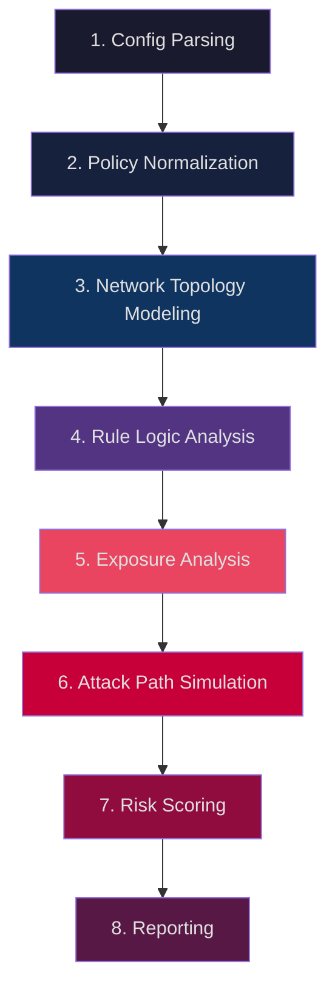

# FortiCheck — ADIM 1 & 2: Ürün Vizyonu ve Temel Yetenekler

---

## ADIM 1 — ÜRÜN VİZYONU

### 1.1 Ürünün Amacı

FortiCheck, FortiGate firewall konfigürasyon ve policy export dosyalarını **statik analiz** yoluyla inceleyen, güvenlik açıklarını, mantık hatalarını ve mimari zafiyetleri tespit eden bir **offline güvenlik analiz platformu**dur.

Sistemin temel felsefesi: **"Compliance ≠ Security."** Bir firewall PCI-DSS veya ISO 27001 kontrol listeleri açısından uyumlu olabilir, ancak yine de ciddi güvenlik açıkları barındırabilir. FortiCheck bu farkı kapatır.

### 1.2 Hedef Kullanıcılar

| Persona | Kullanım Senaryosu |
|---|---|
| **SOC Analyst** | Günlük policy review, anomali tespiti |
| **Security Architect** | Segmentasyon doğrulama, trust boundary analizi |
| **MSSP Engineer** | Çoklu müşteri config audit, toplu raporlama |
| **Penetration Tester** | Pre-engagement recon, attack path keşfi |
| **Compliance Auditor** | Kanıta dayalı denetim raporu üretimi |
| **Network Engineer** | Redundant/shadow rule temizliği, optimizasyon |

### 1.3 Çözdüğü Problem

| Problem | Mevcut Durum | FortiCheck Çözümü |
|---|---|---|
| Geniş rule base'lerde görünürlük kaybı | Manuel review, hata riski yüksek | Otomatik shadow/redundancy tespiti |
| Lateral movement riski | Flat network veya zayıf segmentasyon | East-west exposure analizi, graph modelleme |
| Aşırı permissif kurallar | `any/any/any` kuralları fark edilmiyor | Permissiveness skoru, servis granularity analizi |
| Internet exposure | Hangi iç kaynaklar dışarıya açık belirsiz | Zone-aware exposure mapping |
| Security profile eksiklikleri | IPS/AV/Web Filter atanmamış policy'ler | Profile coverage analizi |
| Shadow rules | Hiç çalışmayan kurallar birikimi | Algoritmik shadow detection |

### 1.4 Compliance Araçlarından Farkı

```
┌────────────────────────────────────────────────────────┐
│  Compliance Aracı          │  FortiCheck               │
├────────────────────────────┼───────────────────────────┤
│  Checklist tabanlı         │  Analiz tabanlı           │
│  "Policy var mı?"          │  "Policy ne yapıyor?"     │
│  Statik kontrol            │  Dinamik ilişki analizi   │
│  Kural bazlı               │  Graph bazlı             │
│  Rapor: Pass/Fail          │  Rapor: Risk + Öneri      │
│  Vendor spesifik           │  Canonical model          │
│  Yüzeysel                  │  Derinlemesine            │
└────────────────────────────┴───────────────────────────┘
```

> [!IMPORTANT]
> FortiCheck bir compliance checkbox aracı **değildir**. Gerçek güvenlik mimarisi analizi yapar: trust boundary ihlalleri, lateral movement yolları, exposure yüzeyi ve attack path simülasyonu.

---

## ADIM 2 — TEMEL YETENEKLER (8 KATMAN)

### Katman Mimarisi



### Katman Detayları

#### Katman 1 — Config Parsing

**Görev:** Ham FortiGate config dosyasını yapısal olarak parse etmek.

- FortiOS `config` / `edit` / `set` / `next` / `end` blok söz dizimini yorumlar
- Nested config bloklarını recursive olarak işler
- Her `edit` bloğunu benzersiz key ile indexler
- VDOM-aware parsing (multi-VDOM cihaz desteği)
- Desteklenen giriş: `.conf` export, `show full-configuration` çıktısı, `tech-support` bundle

**Çıktı:** Yapısal config dictionary (JSON-serializable AST)

---

#### Katman 2 — Policy Normalization

**Görev:** Vendor-spesifik veriyi canonical (vendor-bağımsız) modele dönüştürmek.

- FortiGate obje referanslarını çözer (`address`, `addrgrp`, `service`, `service group`)
- Nested grupları recursive olarak flat listeye açar
- Interface → Zone mapping uygular
- Policy'leri canonical `PolicyRule` modeline normalize eder
- Implicit deny kuralını explicit hale getirir

**Çıktı:** Normalize edilmiş canonical policy seti

---

#### Katman 3 — Network Topology Modeling

**Görev:** Config'den ağ topolojisini çıkarmak.

- Interface IP/subnet bilgilerinden doğrudan bağlı ağları çıkarır
- Static route tablosundan ağ erişilebilirliğini modeller
- Zone membership'leri belirler
- VLAN trunk/access yapılarını modeller
- VPN tunnel (IPsec / SSL-VPN) endpoint'leri haritalandırır

**Çıktı:** Topoloji graph (interface, subnet, zone ilişkileri)

---

#### Katman 4 — Rule Logic Analysis

**Görev:** Policy'ler arası mantıksal ilişkileri analiz etmek.

- **Shadow Detection:** Bir kurala asla ulaşılamıyorsa (üstteki kural tüm trafiği karşılıyorsa) tespit eder
- **Redundancy Detection:** Kaldırılsa bile davranış değişmeyecek kuralları bulur
- **Conflict Detection:** Aynı trafiğe çelişkili eylem uygulayan kuralları saptar
- **Hit analysis:** Disabled, log count = 0 veya son kullanım tarihi eski kuralları işaretler
- **Ordering anomalies:** Daha spesifik kuralın daha genel kuralın altında olmasını tespit eder

**Çıktı:** Rule logic finding listesi (shadow, redundant, conflict, anomaly)

---

#### Katman 5 — Exposure Analysis

**Görev:** Hangi kaynakların hangi yönlerde açık olduğunu belirlemek.

- **Internet Exposure:** Untrusted zone'dan iç kaynaklara izin veren policy'ler
- **East-West Exposure:** Farklı iç zone'lar arası izinler (lateral movement yüzeyi)
- **Service Exposure:** Hangi portlar/protokoller hangi zone pair'lere açık
- **Excessive Permissions:** `any` source/destination/service kullanan kurallar
- **Security Profile Gaps:** IPS, AV, Web Filter, SSL Inspection atanmamış kurallar

**Çıktı:** Zone-pair bazlı exposure matrisi

---

#### Katman 6 — Attack Path Simulation

**Görev:** Olası saldırı yollarını simüle etmek.

- Topoloji graph + policy edge'lerinden yürünebilir yolları hesaplar
- Internet → DMZ → Internal gibi multi-hop attack chain'leri keşfeder
- Her hop'un geçtiği policy ve servisi kaydeder
- Trust level farkına göre path criticality hesaplar
- Pivot noktalarını (birden fazla zone'a erişen host/subnet) tespit eder

**Çıktı:** Attack path listesi (kaynak → hedef, hop dizisi, risk skoru)

---

#### Katman 7 — Risk Scoring

**Görev:** Her bulguya 0-100 arası risk skoru atamak.

- Exposure seviyesi (internet vs internal)
- Trust farkı (zone'lar arası trust delta)
- Servis hassasiyeti (SSH/RDP/SMB vs HTTP)
- İzin genişliği (specificity vs permissiveness)
- Security profile eksikliği
- Weighted composite score hesaplama

**Çıktı:** Skorlanmış finding listesi, cihaz bazlı aggregate risk

---

#### Katman 8 — Reporting

**Görev:** Tüm analiz sonuçlarını profesyonel HTML rapor olarak sunmak.

- Executive summary (C-level okunabilirlik)
- Kritik risk tablosu
- İnteraktif heatmap ve grafikler
- Kategori bazlı detaylı bulgular
- Her bulgu için remediation önerisi
- Dışa aktarım: HTML (self-contained), JSON, CSV

**Çıktı:** Standalone HTML güvenlik raporu
