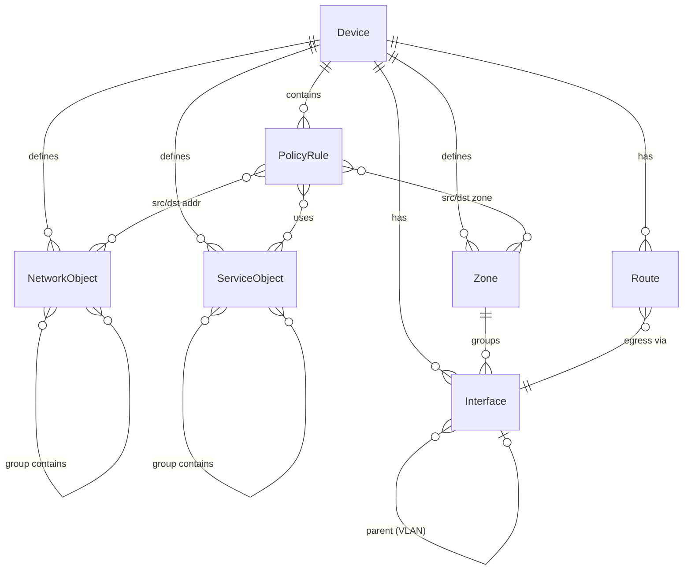
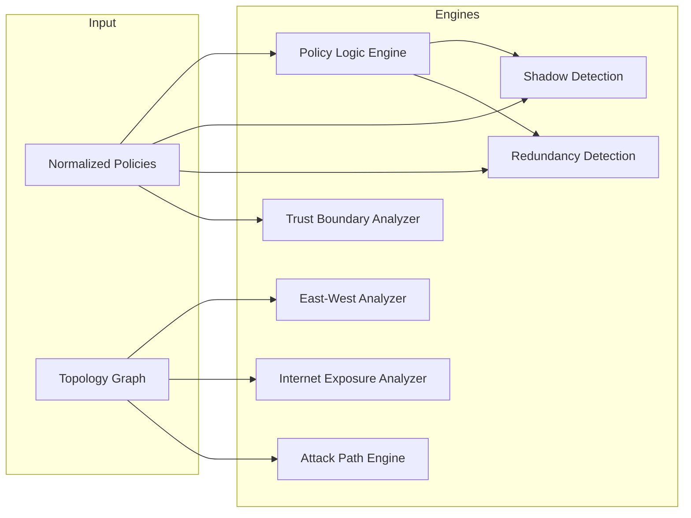

# FortiCheck — ADIM 3 & 4: Veri Modeli ve Analiz Motorları

---

## ADIM 3 — CANONICAL VERİ MODELİ

### 3.1 Tasarım Prensibi

Vendor-bağımsız bir veri modeli kullanarak, aynı analiz motorlarının gelecekte Palo Alto, Cisco ASA, pfSense gibi farklı vendor config'lerine de uygulanabilmesini sağlamak.

### 3.2 Varlık Tanımları

#### Device
```
Device {
  id: string               # Benzersiz cihaz tanımlayıcı
  hostname: string
  vendor: enum(fortigate, paloalto, cisco_asa, ...)
  firmware_version: string
  vdoms: list[VDOM]        # Multi-VDOM desteği
  serial_number: string
  ha_mode: enum(standalone, active_passive, active_active)
}
```

#### Interface
```
Interface {
  id: string
  name: string              # port1, wan1, vlan100
  type: enum(physical, vlan, loopback, tunnel, aggregate)
  ip_address: CIDR | null
  zone: Zone.id | null
  vdom: VDOM.id
  status: enum(up, down, admin_down)
  connected_networks: list[CIDR]
  vlan_id: int | null
  parent_interface: Interface.id | null   # VLAN parent
}
```

#### Zone
```
Zone {
  id: string
  name: string              # trust, untrust, dmz, internal
  trust_level: int (0-100)  # 0=untrusted, 100=most trusted
  interfaces: list[Interface.id]
  networks: list[CIDR]      # Zone'a ait tüm subnet'ler (hesaplanmış)
}
```

#### NetworkObject
```
NetworkObject {
  id: string
  name: string
  type: enum(host, subnet, range, fqdn, geo, wildcard, group)
  value: string | CIDR | IPRange
  members: list[NetworkObject.id]   # group türü için
  resolved_cidrs: list[CIDR]        # flat resolved IP listesi
}
```

#### ServiceObject
```
ServiceObject {
  id: string
  name: string
  type: enum(tcp, udp, icmp, ip, group)
  protocol: string
  port_range: PortRange | null       # 80, 443, 1024-65535
  members: list[ServiceObject.id]    # group türü için
  resolved_ports: list[PortRange]    # flat resolved port listesi
  sensitivity: enum(critical, high, medium, low)  # SSH=critical, HTTP=low
}
```

#### Policy (PolicyRule)
```
PolicyRule {
  id: string
  sequence: int              # Kural sırası (evaluation order)
  name: string | null
  enabled: bool
  source_zones: list[Zone.id]
  destination_zones: list[Zone.id]
  source_addresses: list[NetworkObject.id]
  destination_addresses: list[NetworkObject.id]
  services: list[ServiceObject.id]
  action: enum(accept, deny, ipsec)
  nat: bool
  log: bool
  security_profiles: {
    antivirus: string | null
    ips: string | null
    web_filter: string | null
    app_control: string | null
    ssl_inspection: string | null
  }
  schedule: string
  comments: string | null
  # Hesaplanan alanlar
  resolved_src_cidrs: list[CIDR]
  resolved_dst_cidrs: list[CIDR]
  resolved_services: list[PortRange]
}
```

#### Route
```
Route {
  id: string
  destination: CIDR          # 0.0.0.0/0 = default route
  gateway: IP | null
  interface: Interface.id
  distance: int
  priority: int
  type: enum(static, connected, policy_route)
}
```

### 3.3 Varlık İlişkileri (Entity Relationship)



**Anahtar İlişkiler:**
- `Device` 1:N `Interface`, `Zone`, `PolicyRule`, `Route`
- `Zone` 1:N `Interface` (bir interface sadece bir zone'a ait)
- `PolicyRule` N:M `Zone` (source_zones, destination_zones)
- `PolicyRule` N:M `NetworkObject` ve `ServiceObject`
- `NetworkObject` self-referencing (group → members)
- `Route` N:1 `Interface` (egress interface)

---

## ADIM 4 — ANALİZ MOTORLARI

### Motor Mimarisi



---

### 4.1 Policy Logic Engine

**Sorumluluk:** İki policy arasındaki mantıksal ilişkiyi belirlemek.

**Temel İşlemler:**
- **Subset testi:** Policy A'nın trafik kümesi, Policy B'nin alt kümesi mi?
- **Intersection testi:** İki policy'nin kesişen trafik kümesi var mı?
- **Superset testi:** Policy A, Policy B'yi tamamen kapsıyor mu?

**Algoritma:** Her policy'yi `(src_ip_set × dst_ip_set × service_set)` şeklinde bir 3-boyutlu küme olarak modeller. İki kümenin ilişkisini belirlemek için her boyutta ayrı ayrı subset/superset karşılaştırması yapar.

---

### 4.2 Shadow Detection Engine

**Sorumluluk:** Hiçbir zaman eşleşmeyecek (dead) kuralları tespit etmek.

**Mantık:** Bir policy *shadowed* ise:
1. Üstündeki bir veya daha fazla policy, bu policy'nin tüm trafik kümesini zaten karşılıyor
2. Bu policy'ye hiçbir paket ulaşamaz

**Shadow Türleri:**
| Tür | Açıklama |
|---|---|
| Full Shadow | Yukarıdaki tek bir kural tüm trafiği karşılıyor |
| Partial Shadow | Birden fazla üst kural birlikte tüm trafiğı karşılıyor |
| Redundant Shadow | Aynı action, dolayısıyla zararsız ama gereksiz |
| Conflicting Shadow | Farklı action, potansiyel güvenlik riski |

---

### 4.3 Redundancy Detection Engine

**Sorumluluk:** Kaldırılsa bile ağ davranışını değiştirmeyecek kuralları bulmak.

**Mantık:** Bir policy *redundant* ise:
1. Bu policy kaldırıldığında, bu policy'nin karşıladığı tüm trafik, altındaki veya üstündeki başka policy'ler tarafından aynı action ile karşılanacaksa → redundant

**Fark:** Shadow = yukarıdan ezilmiş, Redundant = aşağıdan zaten karşılanmış.

---

### 4.4 Trust Boundary Analyzer

**Sorumluluk:** Zone'lar arası güven sınırı ihlallerini tespit etmek.

**İşlemler:**
- Zone trust level farkını hesaplar (trust delta)
- Yüksek trust → düşük trust yönündeki izinler normal kabul eder
- Düşük trust → yüksek trust yönündeki izinleri risk olarak işaretler
- Trust delta büyüklüğüne göre risk ağırlığı atar
- Aynı trust seviyesindeki zone'lar arası izinleri (east-west) ayrı kategoride değerlendirir

---

### 4.5 East-West Exposure Analyzer

**Sorumluluk:** İç ağlar arası yanal hareket (lateral movement) yüzeyini analiz etmek.

**İşlemler:**
- İç zone'lar arası tüm izin veren policy'leri haritalandırır
- Zone-pair bazlı servis exposure matrisi oluşturur
- Kritik servislerin (RDP, SMB, SSH, WinRM, WMI) iç ağda ne kadar geniş yayıldığını ölçer
- Mikro-segmentasyon seviyesini değerlendirir

**Çıktı:** East-west exposure heatmap

---

### 4.6 Internet Exposure Analyzer

**Sorumluluk:** İnternetten erişilebilir iç kaynakları tespit etmek.

**İşlemler:**
- Untrusted zone'dan (WAN, Internet) iç zone'lara izin veren tüm policy'leri bulur
- NAT/VIP mapping'leri çözer
- Açık port/servis listesi çıkarır
- Security profile (IPS, AV, WAF) atanmamış internet-facing policy'leri işaretler
- DNAT hedef IP'lerini internal asset inventory'ye eşler

---

### 4.7 Attack Path Engine

**Sorumluluk:** Çok aşamalı saldırı yollarını simüle etmek.

**Algoritma:**
1. Topoloji graph'ından kaynak node seç (örn: Internet)
2. Bu node'dan izin veren policy'ler üzerinden ulaşılabilir hedef node'ları bul
3. Her hedef node'dan tekrar yürüyerek multi-hop path'leri keşfet
4. BFS/DFS ile tüm olası attack chain'leri enumerate et
5. Her path için composite risk skoru hesapla
6. En kritik N path'i raporla

**Pivot Tespiti:** Birden fazla zone'a policy üzerinden erişimi olan subnet'ler *pivot noktası* olarak işaretlenir.
