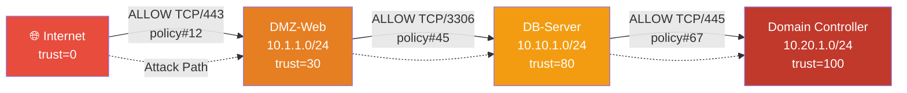

# FortiCheck — ADIM 5 & 6: Graph Modeli ve Risk Skorlama

---

## ADIM 5 — GRAPH TABANLI GÜVENLİK MODELİ

### 5.1 Temel Kavram

```
Network   = Graph (Directed, Weighted)
Zones     = Node clusters with Trust Levels
Subnets   = Nodes
Policies  = Directed Edges (with conditions)
```

### 5.2 Graph Yapısı

#### Node Türleri

| Node Türü | Temsil Ettiği | Özellikler |
|---|---|---|
| **ZoneNode** | Güvenlik zone'u | trust_level, name |
| **SubnetNode** | IP subnet | cidr, zone_id, is_internet |
| **HostNode** | Tekil host / VIP | ip, zone_id, exposed_services |

#### Edge Türleri

| Edge Türü | Temsil Ettiği | Özellikler |
|---|---|---|
| **PolicyEdge** | İzin veren firewall kuralı | policy_id, services, action, has_security_profile |
| **RouteEdge** | Routing erişilebilirliği | route_id, distance, interface |
| **ImplicitDenyEdge** | Varsayılan red kuralı | (edge yokluğu = implicit deny) |

### 5.3 Graph Oluşturma Algoritması

```
1. Her zone için bir ZoneNode oluştur
2. Her interface subnet'i için bir SubnetNode oluştur → zone'a bağla
3. VIP/DNAT hedefleri için HostNode oluştur
4. İnternet için özel bir SubnetNode oluştur (0.0.0.0/0, trust=0)
5. Her ALLOW policy için:
   a. src_zone.subnets → dst_zone.subnets arası PolicyEdge oluştur
   b. Edge metadata: services, security_profiles, policy_id
6. Route tablosundan RouteEdge'leri ekle (reachability doğrulaması için)
```

### 5.4 Attack Path Hesaplama



**Algoritma: Modified BFS/DFS with Trust Gradient**

```
function find_attack_paths(graph, source_node, max_depth=5):
    paths = []
    queue = [(source_node, [source_node], 0)]  # (current, path, depth)
    
    while queue:
        current, path, depth = queue.pop(0)
        if depth >= max_depth:
            continue
        
        for edge in graph.outgoing_edges(current):
            if edge.action != ALLOW:
                continue
            target = edge.target
            if target in path:  # Döngü önleme
                continue
            
            new_path = path + [target]
            trust_delta = target.trust_level - source_node.trust_level
            
            if trust_delta > 0:  # Düşük trust → yüksek trust = ilginç
                paths.append(AttackPath(
                    hops=new_path,
                    edges=collected_edges,
                    trust_gain=trust_delta
                ))
            
            queue.append((target, new_path, depth + 1))
    
    return sorted(paths, key=lambda p: p.risk_score, reverse=True)
```

**Önemli Kurallar:**
- Sadece trust artışı yönündeki yollar attack path olarak kabul edilir
- Her hop'ta geçilen policy ve servis kaydedilir
- Döngüler engellenir (visited set)
- Max depth sınırı ile kontrol altında tutulur (default: 5 hop)
- Pivot noktaları: birden fazla zone'a bağlantısı olan node'lar özel olarak işaretlenir

---

## ADIM 6 — RİSK SKORLAMA MODELİ

### 6.1 Skor Bileşenleri

Her bulgu (finding) için 5 boyutlu bir risk değerlendirmesi yapılır:

| Faktör | Ağırlık | Açıklama | Skor Aralığı |
|---|---|---|---|
| **Exposure (E)** | 30% | Bulgunun exposure yüzeyi | 0-100 |
| **Trust Delta (T)** | 25% | Zone'lar arası trust farkı | 0-100 |
| **Service Sensitivity (S)** | 20% | Açık servislerin hassasiyeti | 0-100 |
| **Permission Breadth (P)** | 15% | İzin genişliği (any/any/any) | 0-100 |
| **Profile Gap (G)** | 10% | Security profile eksikliği | 0-100 |

### 6.2 Alt Skor Hesaplama

#### Exposure Skoru (E)

| Durum | Skor |
|---|---|
| Internet → Internal (yüksek trust) | 100 |
| Internet → DMZ | 70 |
| Internal zone → Internal zone (east-west) | 50 |
| Aynı zone içi | 20 |
| Yüksek trust → düşük trust (outbound) | 10 |

#### Trust Delta Skoru (T)

```
T = (dst_zone.trust_level - src_zone.trust_level) / 100 × 100
```

Örnek: Internet (trust=0) → DC Zone (trust=100) → T = 100

#### Service Sensitivity Skoru (S)

| Servis Kategorisi | Skor |
|---|---|
| RDP (3389), SMB (445), WinRM (5985/5986) | 100 |
| SSH (22), Telnet (23), VNC (5900) | 90 |
| Database (1433, 3306, 5432, 1521, 27017) | 85 |
| LDAP (389/636), Kerberos (88) | 95 |
| DNS (53), NTP (123) | 40 |
| HTTP (80), HTTPS (443) | 30 |
| ALL / ANY | 100 |

#### Permission Breadth Skoru (P)

```
P = (src_breadth + dst_breadth + svc_breadth) / 3

where:
  src_breadth = "all" ise 100, CIDR genişliğine göre 0-100 arası
  dst_breadth = "all" ise 100, CIDR genişliğine göre 0-100 arası
  svc_breadth = "ALL" ise 100, port sayısına göre 0-100 arası
```

#### Profile Gap Skoru (G)

```
G = missing_profiles_count / total_expected_profiles × 100

Expected profiles (internet-facing policy):
  - antivirus, ips, web_filter, ssl_inspection → 4 profil

Örnek: 4 profilden 3'ü eksik → G = 75
```

### 6.3 Composite Risk Score

```
Risk = (E × 0.30) + (T × 0.25) + (S × 0.20) + (P × 0.15) + (G × 0.10)
```

### 6.4 Risk Seviyeleri

| Skor Aralığı | Seviye | Renk | Aksiyon |
|---|---|---|---|
| 85-100 | **Critical** | 🔴 Kırmızı | Acil müdahale |
| 70-84 | **High** | 🟠 Turuncu | 24 saat içinde |
| 50-69 | **Medium** | 🟡 Sarı | Planlı iyileştirme |
| 25-49 | **Low** | 🔵 Mavi | Takip |
| 0-24 | **Info** | ⚪ Gri | Bilgilendirme |

### 6.5 Cihaz Seviyesi Aggregate Skor

```
Device_Risk = max(finding_scores) × 0.4 + avg(top10_findings) × 0.3 + 
              (critical_count × 5 + high_count × 3) × 0.3
```

Bu formül hem en kötü durumu (max) hem de genel sağlığı (avg) hem de bulgu yoğunluğunu (count) dikkate alır.
