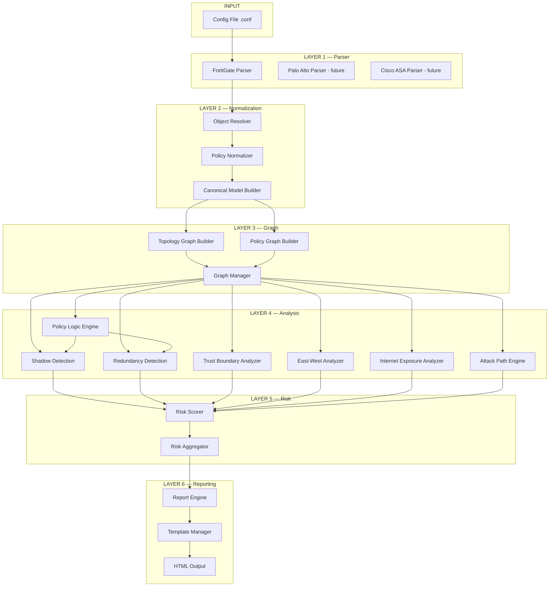

# FortiCheck — ADIM 7 & 8: Rapor Yapısı ve Sistem Mimarisi

---

## ADIM 7 — RAPOR YAPISI

### 7.1 Rapor Bölümleri

Profesyonel HTML güvenlik raporu aşağıdaki bölümlerden oluşur:

#### 1. Executive Summary
- Tek sayfalık üst yönetim özeti
- Cihaz adı, analiz tarihi, toplam policy sayısı
- Aggregate risk skoru (gauge chart)
- Critical / High / Medium / Low bulgu sayıları
- Tek paragraf risk değerlendirmesi

#### 2. Kritik Riskler Tablosu
- Risk skoru ≥ 85 olan bulgular
- Her bulgu: ID, kategori, etkilenen policy, risk skoru, açıklama
- Severity badge ile renk kodlu
- Doğrudan remediation önerisi

#### 3. Internet Exposure Analizi
- İnternetten erişilebilir tüm iç kaynakların listesi
- Hedef IP, port, arkasındaki servis tahmini
- VIP/DNAT mapping'leri
- Security profile coverage durumu
- Exposure topology diyagramı

#### 4. Lateral Movement Risk Analizi
- East-west exposure heatmap (zone × zone matrisi)
- Kritik servis yayılım haritası (SMB, RDP, SSH iç ağda nerede açık)
- Pivot noktaları listesi
- Segmentasyon skoru

#### 5. Shadow Rules
- Tespit edilen shadow kuralları listesi
- Shadowing yapan kural referansı
- Shadow türü (full, partial, conflicting)
- Tavsiye: kaldır veya sıralama değiştir

#### 6. Aşırı İzinli Policy'ler
- `any` source, `any` destination veya `ALL` service içeren policy'ler
- Permissiveness skoru
- Önerilen daraltma (specific subnet, specific port)

#### 7. Segmentasyon Boşlukları
- Beklenen zone izolasyonuna göre ihlaller
- Kritik zone'lara (DC, DB, Management) geniş erişimler
- Missing deny kuralları
- Mikro-segmentasyon değerlendirmesi

#### 8. Risk Heatmap
- Zone-pair bazlı interaktif heatmap
- Renk yoğunluğu = risk seviyesi
- Tıklanabilir hücreler → detay policy listesi
- Satır: source zone, Sütun: destination zone

#### 9. Çözüm Önerileri
- Bulgu kategorisi bazlı remediation listesi
- Öncelik sıralaması (risk skoru × effort)
- Her öneri: ne yapılmalı, neden, FortiGate CLI örneği (opsiyonel)
- Quick wins vs long-term improvements ayrımı

### 7.2 Rapor Formatı

| Özellik | Detay |
|---|---|
| Format | Self-contained single HTML file |
| CSS/JS | Inline (harici bağımlılık yok) |
| Grafikler | Chart.js veya inline SVG |
| Dışa aktarım | JSON, CSV sidebar export butonları |
| Responsive | Desktop + tablet uyumlu |
| Dark Mode | Opsiyonel toggle |
| Branding | Özelleştirilebilir logo ve renk şeması |

---

## ADIM 8 — SİSTEM MİMARİSİ

### 8.1 Modüler Katman Mimarisi



### 8.2 Katman Sorumlulukları

#### Layer 1 — Parser Katmanı

| Modül | Dosya (önerilen) | Sorumluluk |
|---|---|---|
| `FortiGateParser` | `parsers/fortigate.py` | FortiOS config syntax parse |
| `ParserFactory` | `parsers/factory.py` | Vendor'a göre doğru parser seçimi |
| `ConfigAST` | `parsers/ast.py` | Parse edilmiş config ağaç yapısı |

#### Layer 2 — Normalization Katmanı

| Modül | Dosya (önerilen) | Sorumluluk |
|---|---|---|
| `ObjectResolver` | `normalizer/resolver.py` | Address/service group recursive çözme |
| `PolicyNormalizer` | `normalizer/policy.py` | Vendor policy → canonical PolicyRule |
| `CanonicalModelBuilder` | `normalizer/builder.py` | Tüm varlıkları canonical modele birleştirme |

#### Layer 3 — Graph Katmanı

| Modül | Dosya (önerilen) | Sorumluluk |
|---|---|---|
| `TopologyGraphBuilder` | `graph/topology.py` | Interface/subnet/zone graph'ı oluşturma |
| `PolicyGraphBuilder` | `graph/policy_graph.py` | Policy edge'lerini ekleme |
| `GraphManager` | `graph/manager.py` | Graph query, traversal API |

#### Layer 4 — Analysis Katmanı

| Modül | Dosya (önerilen) | Sorumluluk |
|---|---|---|
| `PolicyLogicEngine` | `analysis/logic.py` | Policy küme karşılaştırma |
| `ShadowDetector` | `analysis/shadow.py` | Shadow rule tespiti |
| `RedundancyDetector` | `analysis/redundancy.py` | Redundant rule tespiti |
| `TrustBoundaryAnalyzer` | `analysis/trust.py` | Zone trust ihlalleri |
| `EastWestAnalyzer` | `analysis/eastwest.py` | Lateral movement yüzeyi |
| `InternetExposureAnalyzer` | `analysis/exposure.py` | Internet-facing risk |
| `AttackPathEngine` | `analysis/attack_path.py` | Multi-hop saldırı yolu simülasyonu |

#### Layer 5 — Risk Katmanı

| Modül | Dosya (önerilen) | Sorumluluk |
|---|---|---|
| `RiskScorer` | `risk/scorer.py` | Finding bazlı 5-faktörlü skor hesaplama |
| `RiskAggregator` | `risk/aggregator.py` | Cihaz/zone bazlı aggregate skor |

#### Layer 6 — Raporlama Katmanı

| Modül | Dosya (önerilen) | Sorumluluk |
|---|---|---|
| `ReportEngine` | `reporting/engine.py` | Veri toplama, bölüm orchestration |
| `TemplateManager` | `reporting/templates.py` | HTML/CSS template yönetimi |
| `ChartRenderer` | `reporting/charts.py` | Heatmap, gauge, bar chart üretimi |

### 8.3 CLI Arayüzü

```
forticheck analyze --config firewall.conf --output report.html
forticheck analyze --config firewall.conf --format json
forticheck analyze --config firewall.conf --zones-trust zones.yaml
forticheck compare --before old.conf --after new.conf
```

### 8.4 Konfigürasyon

Zone trust level'ları kullanıcı tarafından özelleştirilebilir:

```yaml
# zones_trust.yaml
zones:
  wan1: { trust_level: 0, label: "Internet" }
  dmz: { trust_level: 30, label: "DMZ" }
  internal: { trust_level: 70, label: "Internal" }
  servers: { trust_level: 80, label: "Server Farm" }
  dc: { trust_level: 100, label: "Domain Controllers" }
  management: { trust_level: 95, label: "Management" }

service_sensitivity:
  critical: [3389, 445, 5985, 5986, 22, 23]
  high: [1433, 3306, 5432, 389, 636, 88]
  medium: [53, 123, 161, 514]
  low: [80, 443, 8080, 8443]
```
